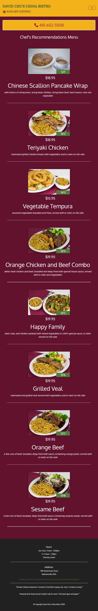

<h1 align="center">Restaurant Site</h1>
<h3 align="center">Introduction</h3>

<b>This is a sample site for restaurant which is fully responsive. It includes the menu,location of the restaurant,photos and description of the dishes and even the prices. All images present in the menu  and single menu pages are dynamically loaded using ajax and even the price and description are fetched from a json file deployed on heroku.Also a simple loader is present on the website
  </b>

<h2 align="center">Table of contents </h2>

* <a href="#pages">Pages </a>
* <a href="#tech-and-framework-used">Tech and framework used </a>
* <a href="#link-to-the-project ">Link to the project  </a>
* <a href="#screenshots">Screenshots </a>

## Pages
__There are 3 pages in the website-:__
* Home-: This page contains a jumbotron, 3 tiles which contain a map,menu and also special menu category. Also there is a responsive navbar present which collapses when the screen size is below 768px and similarly a responsive footer is also present.
* Menu-: This page shows all the menu categories present.All the images and even the menu category text is loaded dynamically using ajax and the data present in a json file hosted on heroku.
* Single Menu Category-: This page contains the description of the dish,price of a small portoin and large portion and even an image for the same.Just like the menu page everything on this page is loaded dynamically and the json in which the data is present is hosted on heroku.

 ## Tech and framework used
* HTML
* CSS
* JavaScript
* Bootstrap
* Ajax

## Link to the project 

https://animeshsingh75.github.io/Restaurant-Website/

## Screenshots
* 1200px and above

  
 

* 768px-1199px

   
 

* 576px-767px

  
 

 
* 575px and below

  
 

